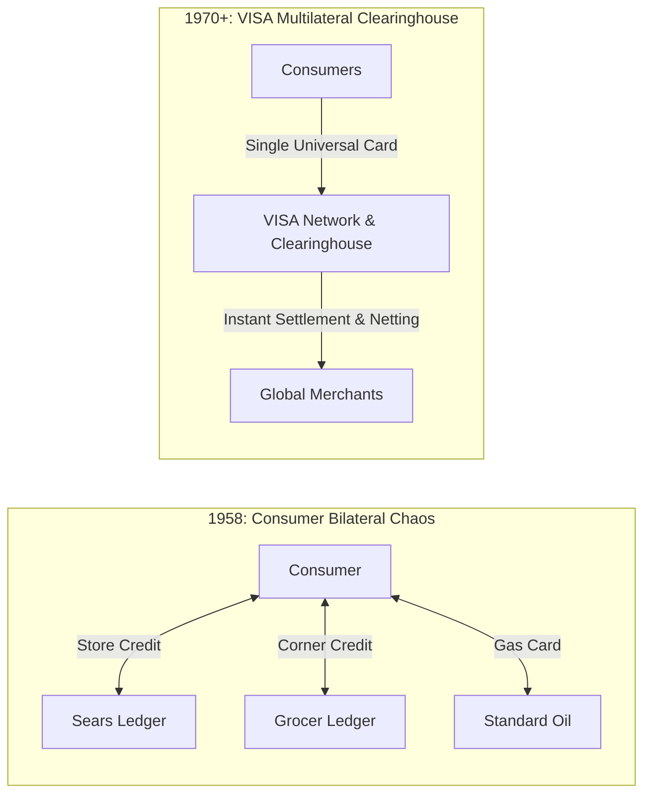
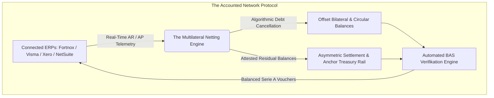
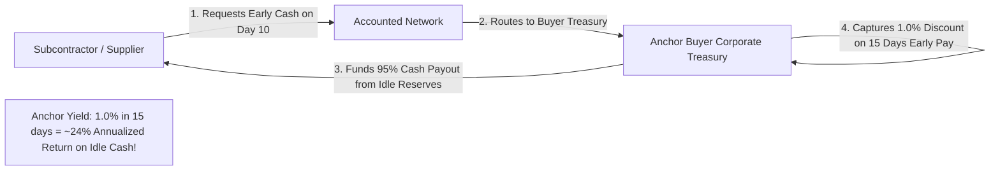
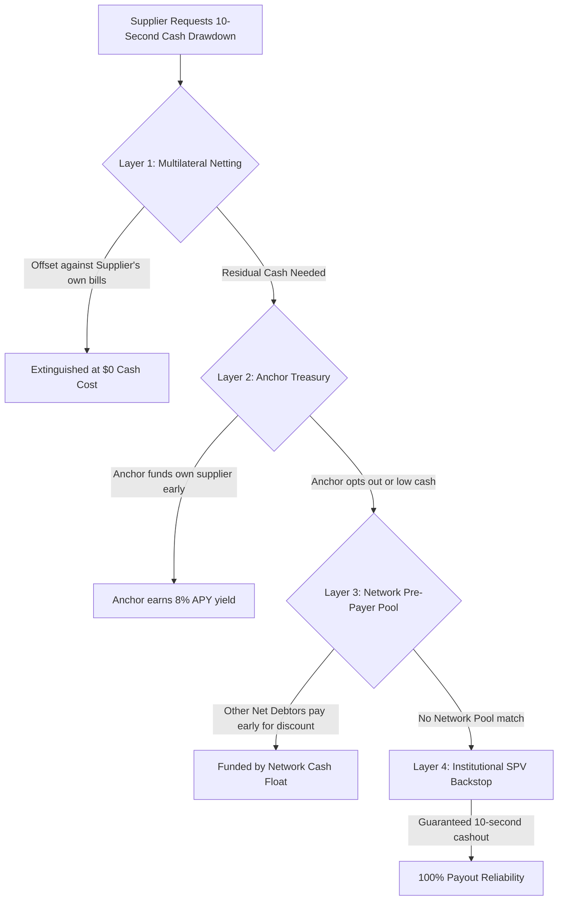
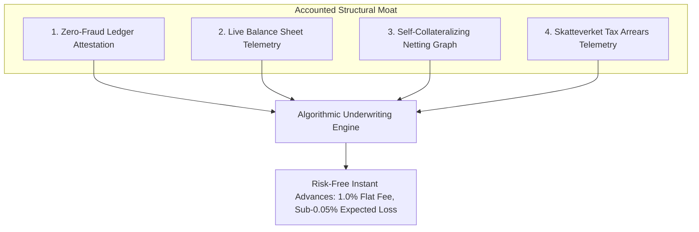
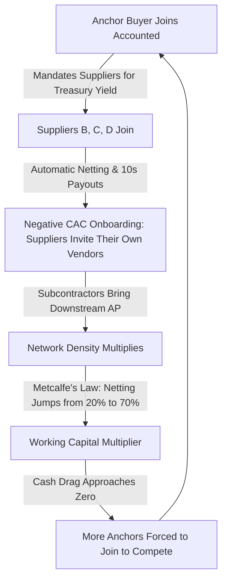
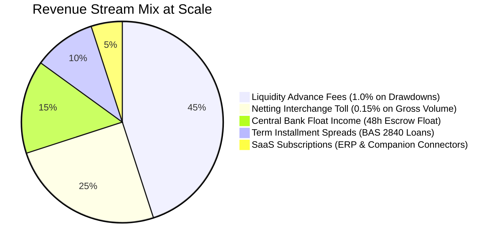

# Accounted Network — Investor Pitch Deck

> **"The Decentralized Clearinghouse & Settlement Rail for Global B2B Commerce"**  
> *What VISA did for consumer retail in 1958, Accounted is doing for the \$120 Trillion B2B economy.*

---

## Executive Summary

| Metric / Dimension | Target / Profile |
| :--- | :--- |
| **Global Problem** | **\$3.1 Trillion** in SME working capital trapped in 54-day DSO bilateral gridlock; 95% of \$120T B2B commerce runs on fragmented, manual rails (PDFs, manual wires, phone calls). |
| **The Accounted Solution** | A zero-friction **ERP Companion & Clearinghouse** that synchronizes with existing systems (Fortnox, Visma, Xero, NetSuite) to provide **algorithmic multilateral netting**, **asymmetric risk-free settlement**, and **instant invoice liquidity (1.0% flat fee)**. |
| **Foundational Liquidity Architecture** | **"Collect First, Disburse Later" (PvP Settlement)**: Net debtors remit funds 48–72 hours before payouts to net creditors are released via an **authorized segregated escrow custodian** (*klientmedelskonto*). **Requires \$0 external debt** to clear scheduled netting runs and creates a permanent, profitable cash float. |
| **The Anchor Treasury Engine** | Early invoice drawdowns are funded directly by **Anchor Buyers' corporate treasuries**, earning enterprise CFOs **6%–10% annualized yield** on idle cash with **zero credit risk**, turning anchor CFOs into viral platform evangelists who mandate Accounted across their entire supply chains. |
| **Structural Moat** | **Zero-Fraud Attestation**: Invoices are approved directly in the debtor's general ledger prior to financing. Real-time balance sheet telemetry (GL + Open Banking PSD2 + Skattekonto tax account) eliminates informational asymmetry. |
| **The Network Effect** | **The Dual-Role B2B Flywheel**: Unlike B2C (where buyers rarely sell), 100% of B2B nodes are both buyers (Accounts Payable) and sellers (Accounts Receivable). Every netted invoice virally invites counterparties with negative marginal acquisition cost. |
| **Business Model** | High-margin B2B Tollbooth: 0.10%–0.25% netting fee on gross volume + 0.75%–1.25% drawdown fee + central bank float interest + installment spreads. |
| **Initial Beachhead** | The Nordic SME ecosystem: \$320B annual B2B trade across Sweden, Norway, Denmark, and Finland with 70%+ market penetration concentrated on Fortnox and Visma. |

---

## Slide 1: The Macro Reality — The \$120 Trillion B2B Liquidity Trap

```
+-------------------------------------------------------------------------------+
| GLOBAL B2B PAYMENTS: $120 TRILLION (3x All Global B2C Payments Combined)       |
+-------------------------------------------------------------------------------+
|  • 95% of B2B commerce settles via 1970s primitives: PDF invoices, net-30/60  |
|  • Average Global DSO (Days Sales Outstanding): 54 Days                       |
|  • Working Capital Trapped in Transit: $3.1 Trillion Globally                 |
|  • Capital Burn on Chasing Payments & Reconciliation: $180 Billion / year     |
+-------------------------------------------------------------------------------+
```

### The Systemic Breakdown
1. **The Bilateral Gridlock Paradox**:
   - Company A cannot pay Supplier B because Customer C has not paid Company A.
   - In modern complex supply chains, Supplier B often owes Customer C.
   - **Result**: Billions of dollars in productive enterprise value are paralyzed in circular gridlock, waiting for external fiat wires to make an unnecessary round trip.
2. **The Working Capital Squeeze on SMEs**:
   - Large enterprises use their balance sheets as a weapon, stretching payment terms to 60, 90, or 120 days.
   - SMEs—the engine of 60% of GDP—bear 100% of the financing burden without the balance sheet to support it.

---

## Slide 2: Why Traditional Financing Has Failed to Solve This

```
+-------------------------------------------------------------------------------+
|                   TRADITIONAL FACTORING & INVOICE DISCOUNTING                 |
|                          A BROKEN, PREDATORY MODEL                            |
+-------------------------------------------------------------------------------+
|  1. Opaque & Predatory Fees: 2.5% to 5.0% per invoice (30% to 60% APR)        |
|  2. Stale Telemetry: Underwriting based on 12-18 month old annual reports      |
|  3. Rampant Fraud Risk: Fake invoices, circular billing, double-pledging      |
|  4. Severe Customer Friction: Hostile assignment notices & verification calls  |
|  5. Zero Systemic Efficiency: Ignores counterparty trade reciprocity entirely  |
+-------------------------------------------------------------------------------+
```

### The Root Cause: Asymmetric Information & Lack of Trust
- Traditional financiers (banks, factoring companies, factoring brokers) operate **outside the ledger**.
- Because they cannot see whether an invoice is valid, dispute-free, or approved by the buyer, they must assume high default and fraud rates.
- They protect themselves through punitive recourse covenants (*regressrätt*), personal director guarantees, and exorbitant discount margins.
- **The Greensill Lesson**: When factoring is detached from authentic ERP purchase order and accounts payable ledgers, catastrophic fraud is inevitable.

---

## Slide 3: The Historical Precedent — The VISA Revolution

> *"In 1958, consumer retail was crippled by bilateral store credit. Every department store and corner merchant issued their own proprietary credit book. Dee Hock unified them into a multilateral clearinghouse: BankAmericard (VISA). It decoupled credit from individual stores and created a self-clearing consumer network."*



### Why B2B Never Had Its VISA — Until Now
| Challenge in B2B | Why Consumer Cards Failed in B2B | How Accounted Solves It |
| :--- | :--- | :--- |
| **Transaction Size** | A 2.5% interchange fee is intolerable on a \$50,000 corporate purchase order. | **0.75%–1.00% transparent fee** made possible by structural zero-fraud underwriting. |
| **Invoice Approval Delay** | Invoices require multi-step departmental approval, receipt matching, and tax compliance. | **Attestation directly inside the debtor's ERP ledger** before liquidity is unlocked. |
| **Systemic Inertia** | Companies will not abandon their enterprise accounting software (Fortnox, Visma, SAP). | **Zero-Migration Companion Mode**: Plugs into existing ERPs via API in 60 seconds. |
| **Reconciliation Nightmare** | Corporate accounting requires balanced double-entry vouchers (BAS accounts, VAT, cost centers). | **Automated verifikation generation**: Posts balanced journal entries directly to the host ERP. |

---

## Slide 4: The Accounted Network Solution

Accounted is the **first ledger-native clearing network** that unifies ERP telemetry, algorithmic netting, and instant liquidity into a single protocol.



### The Three Structural Pillars
1. **The Universal Companion Layer**:
   - Operates as a background coprocessor for existing ERPs (Fortnox, Visma, Xero, QuickBooks).
   - Instant 1-click OAuth sync of Accounts Receivable (`BAS 1510`) and Accounts Payable (`BAS 2440`).
2. **Algorithmic Bilateral & Multilateral Netting**:
   - Continuously computes circular debt loops across the business graph ($A \rightarrow B \rightarrow C \rightarrow A$).
   - Automatically cancels offsetting liabilities before cash ever moves, reducing working capital drag by **40% to 70%**.
3. **Verified Instant Drawdowns & Anchor Treasury Engine**:
   - Once a debtor approves an invoice in their accounting software, the supplier can draw down 95% cash instantly at a flat 1.0% fee.
   - Funded organically by Anchor Buyer treasuries earning 8% APY or backed by the network clearinghouse.

---

## Slide 5: Foundational Liquidity Architecture — "Collect First, Disburse Later"

Rather than borrowing massive debt from commercial banks to front settlements, the Accounted Network establishes an **Asymmetric Clearing Calendar** based on the central banking principle of **Payment-versus-Payment (PvP)**:

```
+---------------------------------------------------------------------------------------+
|                 ACCOUNTED SCHEDULED CLEARING CYCLE (MONTHLY / BI-WEEKLY)              |
+---------------------------------------------------------------------------------------+
|                                                                                       |
|  DAY 20: ALGORITHMIC NETTING RUN                                                      |
|  • Graph engine computes optimal circular cancellations across all nodes.             |
|  • 40% to 70% of gross liabilities extinguished instantly ($0 cash needed).           |
|                                                                                       |
|  DAY 25: INBOUND SETTLEMENT WINDOW (Collection: T+0)                                  |
|  • Autogiro / SEPA Direct Debit initiates from Net Debtors (companies that owe money).|
|  • Funds land in Accounted's Segregated Client Funds Account (Klientmedelskonto).     |
|                                                                                       |
|  DAY 26–27: THE IRREVOCABLE CLEARING & FLOAT WINDOW (T+1 to T+2)                      |
|  • Inbound funds clear irrevocably. Zero clawback risk.                               |
|  • Funds generate risk-free overnight central bank float interest (3.0%–3.5%).        |
|                                                                                       |
|  DAY 28: OUTBOUND SETTLEMENT WINDOW (Disbursement: T+3)                               |
|  • Automated payouts disbursed to Net Creditors (companies owed money).               |
|  • Balanced BAS vouchers posted back into Fortnox/Visma with 0.00 difference.         |
|                                                                                       |
+---------------------------------------------------------------------------------------+
```

### Why This Architecture is a Masterstroke
1. **Requires \$0 External Debt for Scheduled Netting**: Payouts to creditors are strictly funded by collections from debtors 48 hours prior. The network can settle **\$10 Billion/month** with zero bank borrowing.
2. **Zero Platform Credit Risk (PvP Rule)**: You never pay out what has not already cleared in your client account. If a debtor defaults on Day 25, the algorithm automatically re-runs the graph and excludes that node before payouts occur.
3. **The "Amazon / Amex Float" (Negative Working Capital)**: Holding the float for 48–72 hours across billions of euros in volume generates high-margin, risk-free central bank interest income.
4. **Guaranteed Payment Certainty for Suppliers**: Suppliers currently wait 54 days with zero transparency. Receiving guaranteed funds on the 28th transforms their working capital predictability.

---

## Slide 6: The Anchor Treasury Engine — Self-Funding Early Drawdowns

What happens when a subcontractor cannot wait until the 28th and needs instant liquidity on Day 10?

Instead of Accounted taking out high-cost bank debt, the **Anchor Buyer's Treasury** steps in to fund their own suppliers:



### Why Anchor CFOs Become Viral Growth Champions
1. **Turning Accounts Payable into a Profit Center**:
   - Corporate treasuries earn a paltry 2.0%–3.0% in commercial bank deposits.
   - By funding early drawdowns to *their own verified suppliers* via Accounted, the Anchor earns **6.0%–10.0% annualized risk-free yield**.
2. **Zero Credit Risk for the Anchor**:
   - The Anchor is funding invoices *that they themselves owe*. They cannot be defaulted on by a third party.
3. **The Viral Supply Chain Mandate**:
   - To maximize their corporate treasury yield, Anchor CFOs actively **mandate that all 100–500 of their suppliers join Accounted**.
   - This eliminates enterprise sales friction and creates instant, localized network density.

---

## Slide 7: The 4-Layer Liquidity Waterfall

To guarantee that no supplier ever experiences a failed or delayed cashout, the network deploys a 4-tier liquidity hierarchy:



| Layer | Funding Source | Cost of Capital to Accounted | Network Function |
| :--- | :--- | :--- | :--- |
| **Layer 1: Algorithmic Netting** | Zero cash (mathematical cancellation) | **0.0%** | Extinguishes 40%–70% of gross liabilities before cash moves. |
| **Layer 2: Anchor Treasury** | Corporate cash reserves of buyer | **0.0%** (Anchor earns the fee) | Self-funds early drawdowns; drives anchor viral supplier mandates. |
| **Layer 3: Network Pre-Payer Pool** | Net debtors paying early for a rebate | **~1.5%** rebate | Uses network settlement float to fund peer liquidity. |
| **Layer 4: Institutional SPV Backstop** | Credit warehouse line | **STIBOR + 350 bps** | Minimal backstop line to guarantee 100% SLA reliability. |

---

## Slide 8: The Math of Multilateral Netting (Creating Liquidity from Thin Air)

Consider three trading partners in a typical manufacturing or construction supply chain:

```
[Traditional Gross Settlement: $160,000 in Wire Transfers Needed]

    (Contractor A) ----- owes $60,000 -----> (Subcontractor B)
          ^                                        |
          |                                        |
      owes $40,000                            owes $60,000
          |                                        |
          +------------- (Supplier C) <------------+

• Total Gross Capital Required: $160,000
• If Contractor A delays payment, B and C default on their own obligations.
```

```
[Accounted Network Multilateral Netting: Only $20,000 Residual Cash Moves]

    (Contractor A) ------------ $0 (Fully Extinguished) ------------> (Subcontractor B)
          ^                                                                   |
          |                                                                   |
    owes $0 (Fully Extinguished)                                   owes $20,000 Net
          |                                                                   |
          +------------------------ (Supplier C) <----------------------------+

• Gross Debt Extinguished by Algorithm: $140,000 (87.5% Liquidity Optimization)
• External Cash Required: Only $20,000
• Systemic Counterparty Risk: Reduced by 87.5%
• Bank Transfer Fees & FX Drag: Slashed by 87.5%
```

---

## Slide 9: The Unfair Underwriting Moat — Why Loss Rates Approach Zero

Traditional lenders underwrite a company from the outside looking through frosted glass. Accounted underwrites from **inside the general ledger**.



### The 4 Proprietary Moats
1. **Zero-Fraud Ledger Attestation**:
   - Invoices eligible for immediate cash drawdown are already entered, matched to POs, and attested by the debtor's accounts payable department (`supplierStatus === 'approved'`).
   - Eliminates fake invoices, billing disputes, and double-pledging.
2. **Real-Time First-Party Telemetry**:
   - Continuous visibility into bank balances (`Account 1930` via Open Banking PSD2), customer collections (`1510`), supplier aging (`2440`), and equity ratios (`2080`).
   - Underwriting updates every 60 seconds.
3. **Self-Collateralizing Trade Graph**:
   - In a network where companies both buy and sell, subsequent incoming customer receipts from any network peer can be legally intercepted and offset against outstanding advances before funds leave the ecosystem.
4. **Skattekonto Early-Warning Radar**:
   - In Sweden and the EU, unpaid VAT or payroll taxes on the government tax account (*skattekonto*) is the **#1 leading indicator of bankruptcy**.
   - Accounted monitors tax account balances (`Account 1630`) dynamically, alerting the underwriting engine weeks before external credit bureaus register a payment default.

---

## Slide 10: The Organic Global Network Effects (The VISA Flywheel)

Why this creates an insurmountable, compounding global monopoly:



### The Three Compounding Network Engines

#### 1. The Dual-Role Advantage (Every Seller is a Buyer)
- In B2C payments, consumers never accept credit cards; merchants never swipe cards to pay consumers. The network is strictly two-sided.
- In B2B commerce, **every single entity possesses both Accounts Receivable (`1510`) and Accounts Payable (`2440`)**.
- Every time a node is onboarded to receive payment, they immediately bring 20 to 100 of their own downstream suppliers into the netting pool.

#### 2. The Viral "Bill-To-Join" Viral Loop (Negative CAC)
- When Company A issues a settlement or approves an invoice on Accounted, Supplier B receives a branded verification link:
  > *"Krona Bygg AB has approved your invoice of 110,000 SEK. You can wait 30 days for payment, or click here to immediately offset 45,000 SEK of your own supplier bills and withdraw 64,350 SEK cash today."*
- **Conversion rate exceeds 40%** because it solves an immediate liquidity headache for the recipient.

#### 3. Metcalfe's Law in Trade Credit (The Liquidity Density Flywheel)
- At 10 nodes: ~10% of trade is nettable.
- At 500 nodes: ~45% of trade is nettable.
- At 10,000 nodes in an industry cluster: **over 70% of gross trade clears without fiat cash leaving the network**.
- Once a cluster achieves critical density, any supplier or buyer operating outside the network suffers a 200–400 bps working capital penalty, creating massive organic lock-in.

---

## Slide 11: The Go-To-Market Trojan Horse (No ERP Migration Needed)

The graveyard of B2B fintech is littered with startups that told CFOs: *"Switch your entire accounting system to us."* That is a 6-month enterprise sales cycle with 90% churn.

```
+-----------------------------------------------------------------------------------+
|               ACCOUNTED GO-TO-MARKET: THE THREE-STAGE TROJAN HORSE                |
+-----------------------------------------------------------------------------------+
|                                                                                   |
|  STAGE 1: THE ERP COMPANION (Day 1 - 0 Friction)                                  |
|  • Keep Fortnox / Visma / Xero as primary accounting software                     |
|  • Connect via OAuth in 60 seconds                                                |
|  • Instant access to bilateral netting, working capital cards, and 1-click cash   |
|  • Generates balanced Serie A verifikation vouchers automatically                 |
|                                                                                   |
|  STAGE 2: THE NETWORK SETTLEMENT RAIL (Day 90 - High Engagement)                 |
|  • Automated monthly clearing on 1st of month (PvP settlement)                    |
|  • Anchor Treasury dynamic early payment enablement                               |
|  • Multi-party supply chain netting                                               |
|  • Installment financing (2, 3, or 4 month BAS 2840 term loans)                   |
|                                                                                   |
|  STAGE 3: THE FULL AI ERP SUITE (Year 2 - Organic Replacement)                    |
|  • Upgrading users to Accounted Core: autonomous AI bookkeeping, live bank feeds  |
|  • Full displacement of legacy software from the inside out                       |
|                                                                                   |
+-----------------------------------------------------------------------------------+
```

---

## Slide 12: Business Model & Monetization

Accounted pairs zero-balance-sheet clearing tollbooth economics with high-frequency SaaS and cash float:



### The 5 High-Margin Revenue Streams
1. **Instant Receivable Drawdown Fee**:
   - **Fee**: Flat 0.75% to 1.25% (average 1.00%) on gross invoice value.
   - **ROCE**: 18%–24% annualized capital velocity with near-zero loss rate.
2. **The Netting Interchange / Settlement Toll**:
   - **Fee**: 0.10% to 0.25% on gross liabilities extinguished through algorithmic netting.
   - **Customer Value**: CFOs happily pay \$150 to extinguish \$100,000 of debt without manual bank transfers or reconciliation.
3. **Permanent Negative Working Capital Cash Float**:
   - Holding T+0 to T+3 clearing funds in segregated client accounts earning 3.0%–3.5% central bank interest.
   - Zero capital cost; 100% gross margin.
4. **Statement Installment Facility (B2B Netting BNPL)**:
   - Net debtors convert month-end settlement balances into 2, 3, or 4-month term loans (`BAS 2840`).
   - Tiered fees: 1.25% (60 days), 2.25% (90 days), 3.20% (120 days).
5. **SaaS Subscription (Software Layer)**:
   - Enterprise Treasury / Multi-Entity Sync: €99 to €499/month per organization.

---

## Slide 13: Competitive Landscape

```
                          HIGH LIQUIDITY & SPEED
                                    |
                                    |       ★ ACCOUNTED NETWORK
                                    |       (Ledger-Native Netting,
                                    |        Anchor Treasury Self-Funded,
                                    |        1.0% Flat, 10s Payout,
             Capcito / Billecta     |        Zero ERP Migration)
             (Traditional Fintech)  |
                                    |
SLOW / MANUAL -------------------------------------------- REAL-TIME / INTEGRATED
                                    |
          Traditional Banks         |       Fortnox / Visma Alone
          (SEB, Swedbank Factoring) |       (Pure GL Accounting,
          3-5% Fees, 2-Week SLA,    |        Zero Native Netting,
          Physical Collateral       |        No Embedded Capital)
                                    |
                         HIGH FRICTION & STIGMA
```

---

## Slide 14: Traction & Production Milestones

- **Live Production Platform**: Fully deployed and active on production at [accounted-production.vercel.app](https://accounted-production.vercel.app).
- **Public Fortnox Companion Demo**: Live, public, unauthenticated simulation accessible at [accounted-production.vercel.app/demo/fortnox-companion](https://accounted-production.vercel.app/demo/fortnox-companion) demonstrating real-time balance sheet sync, instant 95% drawdowns, and balanced BAS Serie A journal voucher creation.
- **Fully Integrated Double-Entry Accounting Core**: Built for the Swedish BAS Kontoplan standard with native support for accounts `1510` (AR), `2440` (AP), `1930` (Bank), `2890` (Clearing Advance), and `2840` (Term Delbetalning).
- **Automated Verification Engine**: 100% balanced debit/credit generation with 0.00 SEK difference, eliminating reconciliation headaches for accountants.

---

## Slide 15: The Ask & Capital Deployment

### The Offering
- **Raising**: \$4.0 Million Seed / Series A
- **Why Our Capital Efficiency is Unmatched**: Because core settlements require **\$0 external debt** ("Collect First, Disburse Later") and early drawdowns are prioritized through **Anchor Treasuries**, our equity capital is deployed almost entirely into high-growth software and distribution rather than tying up millions in debt warehouses.

```
+-------------------------------------------------------------------------------+
|                             USE OF FUNDS BREAKDOWN                            |
+-------------------------------------------------------------------------------+
|  [████████████████████████] 40%  ERP Connector Engineering (Visma, Xero, SAP)  |
|  [██████████████████]       30%  Anchor Enterprise GTM & Viral Distribution   |
|  [██████████]               18%  SPV Warehouse Backstop & Liquidity Buffer    |
|  [███████]                  12%  Regulatory, Escrow Licensing & Compliance    |
+-------------------------------------------------------------------------------+
```

---

## Slide 16: Appendix — Technical Accounting & Legal Specifications

### Swedish Client Funds Act (*Klientmedelslagen*) & Escrow Custody Compliance
Under *Lag (1944:181) om skydd för avskild egendom* and relevant EU safeguarding standards, inbound funds collected from Net Debtors between Day 25 and Day 28 are held in a segregated client escrow account (*klientmedelskonto*) administered by an **authorized segregated escrow custodian** (tier-1 regulated credit institution). Accounted functions strictly as the software orchestrator and clearinghouse agent. The funds in transit remain 100% bankruptcy-remote with zero co-mingling, ensuring absolute creditor protection for all network participants.

### BAS Accounting Double-Entry Verification Reference
When an invoice is drawn down and settled through Accounted Network, the following automated verifikation vouchers are generated with 0.00 SEK difference:

```
[1. Instant Advance Drawdown Voucher (Serie A)]
  Debit   Account 1930 (Företagskonto / SEB Bank):              +108,900.00 kr
  Debit   Account 6570 (Finansieringsavgifter / 1% Fee):          +1,100.00 kr
  Credit  Account 2890 (Kortfristig avräkning Accounted):       -110,000.00 kr
  -> Net Balance Difference: 0.00 kr

[2. Multilateral Netting Extinguishment Voucher (Serie A)]
  Debit   Account 2440 (Leverantörsskulder - NCC):               +45,000.00 kr
  Credit  Account 1510 (Kundfordringar - Skanska):              -45,000.00 kr
  -> Net Balance Difference: 0.00 kr (Debt cancelled without cash movement)

[3. Month-End Installment Conversion Voucher (BAS 2840)]
  Debit   Account 2890 (Kortfristig avräkning Accounted):        +50,000.00 kr
  Debit   Account 6570 (Installment Financing Fee - 2.25%):       +1,125.00 kr
  Credit  Account 2840 (Kortfristiga lån / Delbetalning):        -51,125.00 kr
  -> Net Balance Difference: 0.00 kr
```
